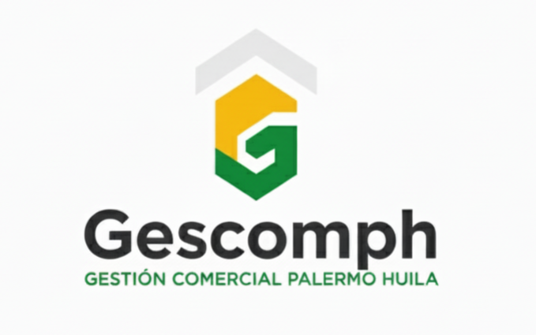

<!-- ===================== ENCABEZADO CON LOGO ===================== -->

  
  <h1>🏛️ GESCOMPH</h1>
  
<b>Gestión de Establecimientos, Contratos, Operaciones, Monitoreo y Pagos del Huila</b> 
  <i>“Más que gestión: desarrollo empresarial.”</i>

  

  
<b>Servicio Nacional de Aprendizaje (SENA)</b> 
  Tecnólogo en Análisis y Desarrollo de Software · 2025

---

## 💡 ¿Por qué “GESCOMPH”?

El nombre **GESCOMPH** proviene de la contracción de **Gestión de Establecimientos, Contratos, Operaciones, Monitoreo y Pagos del Huila**.  
Representa una plataforma integral que impulsa la **transformación digital de la gestión comercial, contractual y operativa en el departamento del Huila**.

Sus siglas reflejan un enfoque multidimensional:

- **“GES” → Gestión:** Control, organización y trazabilidad de la información.  
- **“COM” → Contratos y Comercial:** Administración inteligente de contratos y establecimientos.  
- **“PH” → Pagos del Huila:** Alcance regional y propósito institucional.

El objetivo es consolidar una **plataforma moderna, escalable y transparente**, orientada al fortalecimiento de la productividad empresarial, la automatización de procesos y la eficiencia administrativa en la región.

---

## 🧩 Descripción del Proyecto

**GESCOMPH** es una **plataforma integral de gestión empresarial y comercial**, desarrollada para centralizar los procesos relacionados con **establecimientos, contratos, pagos y monitoreo de operaciones** en el Huila.

Permite digitalizar, automatizar y controlar tareas clave, garantizando la trazabilidad y seguridad de la información, al tiempo que ofrece herramientas de análisis y visualización para la toma de decisiones.

> Integra módulos de **seguimiento, trazabilidad y automatización**, potenciando la **eficiencia, transparencia y desarrollo empresarial en el Huila**.

---

## 🎯 Objetivos

- Digitalizar y centralizar la gestión de establecimientos y contratos comerciales.  
- Automatizar el seguimiento de pagos, obligaciones y operaciones administrativas.  
- Facilitar la trazabilidad y la generación de reportes estratégicos.  
- Mejorar la eficiencia institucional y reducir procesos manuales.  
- Promover la transparencia en la gestión de recursos y contratos.  
- Contribuir al desarrollo económico regional a través de la innovación tecnológica.

---

## ⚙️ Tecnologías Utilizadas

| Categoría                      | Tecnologías                                                                 |
| ------------------------------ | --------------------------------------------------------------------------- |
| **Backend**                    | .NET 8 · C# · Entity Framework Core · Mapster                              |
| **Frontend / App**             | Angular 20 · Material Design · Ionic                                       |
| **Base de Datos**              | SQL Server                                                                 |
| **Arquitectura**               | N-Capas                                                                    |
| **Integración / Comunicación** | SignalR · JWT · Cloudinary                                                 |
| **DevOps / Despliegue**        | Docker · Docker Compose                                                    |
| **Pruebas / Calidad**          | xUnit · Postman · Swagger                                                  |
| **Documentación**              | Markdown · Mermaid · PlantUML · SRS                                        |
| **Gestión del Proyecto**       | ClickUp                                                                    |

---

## 🧠 Arquitectura del Sistema

GESCOMPH implementa una **arquitectura en N-capas** que separa responsabilidades para garantizar mantenibilidad, escalabilidad y seguridad.

### Capas Principales

- **Capa Web / API (Presentación)**  
  API REST en ASP.NET Core que sirve de puente entre backend, frontend y dispositivos móviles.

- **Capa de Negocio (Business Layer)**  
  Contiene la lógica empresarial, validaciones, reglas de negocio y flujos transaccionales.

- **Capa de Datos (Data Layer)**  
  Repositorios genéricos con EF Core y migraciones independientes por proveedor.

- **Capa de Entidades (Entity Layer)**  
  Define los modelos de dominio: Establecimientos, Contratos, Personas, Roles, Pagos, etc.

---

## 👥 Roles de Usuario

| Rol              | Descripción                                                                                                                                                                                                 |
| ---------------- | ----------------------------------------------------------------------------------------------------------------------------------------------------------------------------------------------------------- |
| **Administrador** | Encargado de la **gestión total del aplicativo**. Administra plazas, establecimientos, contratos, pagos, usuarios, roles, permisos y parámetros del sistema. Supervisa la operación y auditoría general. |
| **Usuario (Arrendatario / Empresario)** | Puede **gestionar sus contratos**, consultar locales, visualizar pagos y obligaciones, y **solicitar citas o renovaciones** desde su cuenta autenticada. |
| **Ciudadano (Público)** | No requiere autenticación. Puede **consultar locales disponibles**, ver información pública y **solicitar citas** para conocerlos presencialmente. |

---

## 🧾 Módulos Principales

- **Gestión de Establecimientos y Plazas Comerciales.**  
- **Administración de Contratos y Términos Contractuales.**  
- **Control de Obligaciones, Pagos y Mora.**  
- **Gestión de Personas, Usuarios, Roles y Permisos.**  
- **Parámetros del Sistema, Seguridad y Auditoría.**  
- **Reportes Financieros y Estadísticos.**  
- **Consulta Pública y Solicitud de Citas.**  
- **Monitoreo y Seguimiento Operativo (en desarrollo).**

---

## 👨‍💻 Equipo de Desarrollo

| Integrante                          | Rol / Responsabilidades                                                                                                |
| ----------------------------------- | ---------------------------------------------------------------------------------------------------------------------- |
| **Brayan Santiago Guerrero Mendez** | **Líder del Proyecto** · Arquitectura del sistema · Desarrollo Backend y Frontend · Coordinación técnica y despliegue. |
| **Jesús David Fierro Rivera**       | **Desarrollador Full-Stack** · Implementación de funcionalidades y mantenimiento de módulos.                           |

---

## 🧱 Repositorios del Proyecto

| Módulo              | Descripción                                                                                                                                                                                                                         | Repositorio                                                          |
| ------------------- | ----------------------------------------------------------------------------------------------------------------------------------------------------------------------------------------------------------------------------------- | -------------------------------------------------------------------- |
| **gescomph-api**    | API REST desarrollada en **.NET 8**, con **Entity Framework Core** y **Mapster**, responsable de la lógica de negocio, autenticación y comunicación con los clientes.                                                               | _[gescomph-api](https://github.com/Gescomph/gescomph-api.git)_       |
| **gescomph-portal** | Interfaz administrativa desarrollada en **Angular 20**, destinada a la gestión de establecimientos, contratos, pagos y usuarios.                                                             | _[gescomph-portal](https://github.com/Gescomph/gescomph-portal.git)_ |
| **gescomph-app**    | Aplicación móvil híbrida construida con **Ionic**, orientada a la consulta ciudadana y autogestión empresarial.                                                                              | _[gescomph-app](https://github.com/Gescomph/gescomph-app.git)_       |
| **gescomph-docs**   | Repositorio de documentación técnica y funcional: SRS, casos de uso, bitácoras, diagramas UML y manuales de usuario.                                                                         | _[gescomph-docs](https://github.com/Gescomph/gescomph-docs.git)_     |
| **gescomph-db**     | Contiene la estructura de base de datos, migraciones multi-proveedor (SQL Server y PostgreSQL), seeds iniciales y configuraciones Docker Compose.                                            | _[gescomph-db](https://github.com/Gescomph/gescomph-db.git)_         |

---

## 🧭 Visión Regional

GESCOMPH busca consolidarse como una **plataforma tecnológica de referencia para la gestión comercial, contractual y administrativa del Huila**, promoviendo la **modernización digital, la trazabilidad y la transparencia** en los procesos públicos y privados.

> **Más que gestión: desarrollo empresarial.**

---

## 📜 Licencia

Proyecto académico desarrollado en el marco del  
**Servicio Nacional de Aprendizaje (SENA)**  
Programa **Tecnólogo en Análisis y Desarrollo de Software (ADSO)** — 2025.  
Uso educativo e institucional.
